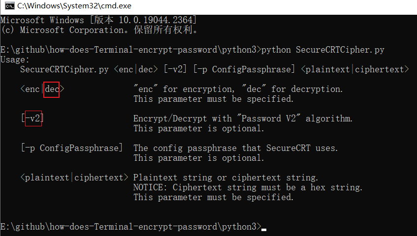
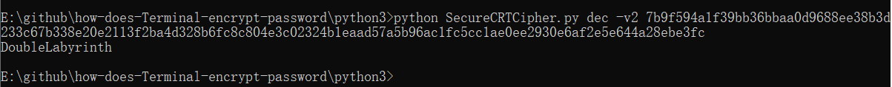

## 1. SecureCRT默认密码存放路径
```
%APPDATA%\VanDyke\Config\Sessions
```
## 2. .ini文件中密码存放位置(SecureCRT 7.3.3版本之后)
```
S:"Password V2"=02:7b9f594a1f39bb36bbaa0d9688ee38b3d233c67b338e20e2113f2ba4d328b6fc8c804e3c02324b1eaad57a5b96ac1fc5cc1ae0ee2930e6af2e5e644a28ebe3fc
```
## 3.如何执行
```
cd how-does-Terminal-encrypt-password\python3
python SecureCRTCipher.py
```

```
python SecureCRTCipher.py dec -v2 7b9f594a1f39bb36bbaa0d9688ee38b3d233c67b338e20e2113f2ba4d328b6fc8c804e3c02324b1eaad57a5b96ac1fc5cc1ae0ee2930e6af2e5e644a28ebe3fc
DoubleLabyrinth
```


